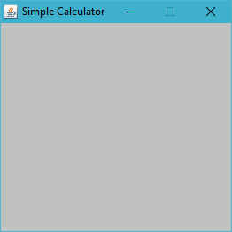

# Practical 3

## Weeks 6 - 9: Checkpoints 11 - 15

### Submission Date

Practical 3 checkpoints are due at the end of your practical session in week 9.

## Getting Started

*Please ensure you read and understand the entire document before you start to code. If clarification is needed, please
seek this as soon as possible.*

In this practical you will implement a simple GUI calculator. You will begin by defining the layout. Then you will
implement the standard operations. Finally, you will implement the memory functionality of the calculator and convert
the structure to make use of arrays.

**Failure to comply with the specifications is not acceptable and will incur penalties**
---

## Checkpoint 11

1. The first task is to open the `GUICalculator` project. Take the time to become familiar with the existing code.
   The `CalculatorDriver` class contains the necessary instructions to create the `JFrame` and instantiate
   a `CalculatorPanel`.
2. In the `CalculatorPanel` class you should declare two constant instance variables `CALC_WIDTH` and `CALC_HEIGHT` and
   initialise the values to 250 and 225 respectively.
3. Set the background colour of the `CalculatorPanel` to light grey and set the preferred size to the previously
   defined `CALC_WIDTH` and `CALC_HEIGHT` values.
4. Run the `CalculatorDriver` file and confirm that your output resembles

Now you will implement the label to display the calculator operations and adding the buttons.

5. Create a `JLabel` to display the calculator operations. Declare an instance variable of type `JLabel` and call
   it `result`.
6. Within the `CalculatorPanel` constructor set up the `JLabel`. The label should be 5 pixels less than the width
   of `CalculatorPanel` and 50 pixels high. Set the initial text for the `JLabel` to 0.
7. Run the application again and confirm the output. This current output is not appropriate, and we need to modify our
   code to ensure we match our initial example.
8. When creating a `JLabel` we can add extra arguments to our call to the constructor. Currently, we
   use `new JLabel("0")`, however we can use a constant value of the `JLabel` class to define the alignment of
   the `JLabel`.  `JLabel.RIGHT` allows us to set the label to align the string to the right of the label. Using the
   following template implement a right aligned label `new JLabel(text, alignment)`.
9. Now we need to modify the font size and style for the label. The `JLabel` class contains a method `setFont` that
   accepts a Font object as an actual parameter. To create a new `Font` object you need to supply the font type, style
   and size: `new Font(type, style, size)`

    - *type* - "Helvetica"
    - *style* - Font.BOLD
    - *size* - 40

10. The next task is to change the background colour of the `JLabel` to white. There is a `setBackground` method for
    the `JLabel` however you also need to set the `JLabel`'s opaque property to true. There is a `mutator` method for
    the `JLabel` class that accepts a `boolean` argument: `setOpaque` to complete this.
11. With the label defined you need to start adding the buttons. You will need to define the necessary instance
    variables to reference each of the buttons. While developing the code for this task take note of the repetition and
    long-winded nature of the code. When working on a later task, you should appreciate the benefits of using arrays.
12. Each `JButton` will need to be set to a preferred size of (55, 30) and should have its Font set to ("Helvetica",
    BOLD, 15). Finally, you will need to set some of the `JButton`'s Font colour to red or blue. `Font` for
    the `JButton` is considered the foreground of the button:

**Hint**: *to change the background colour for a component you use the method* `setBackground`.
13. Complete the layout of your calculator by adding all the buttons to the frame.

---

## Checkpoint 12

For this task you are required to implement the initial functionality of the calculator's standard operations. You will
need to associate a listener with each button and respond to the button click.

There is no need to implement twenty separate listeners for each individual button as the ActionEvent object contains
enough information to differentiate between a range of buttons.

1. Create a *private inner class* called `ButtonListener` that implements the `ActionListener`. Define
   the `actionPerformed` method. Use the `getSource` method from the `ActionEvent` to determine which button was clicked
   by the user.
2. Use a series of selection statements to respond appropriately to the button presses. When a number is pressed first,
   you need to display it on the label. The next time you press a number button append the new number to the end of the
   label text. Continue this process with each number button press.

   *What happens if the number displayed is 0?*

---

## Checkpoint 13

In this task you will complete the calculation and implement the <kbd>Clear</kbd> button.

1. When an arithmetic operator is pressed, retrieve the `String` from the `JLabel`, *parse* it to a `Float` value and
   assign it to a variable `num1`. Consult the Java API to work out how to convert a String to a Float.

   **Hint**: *use the same structure as when we convert a String to an Integer*.
2. You should retrieve the operator and store it in a `char` variable `op`.
3. Follow the same procedure as before to input the second number. When the user presses the equals button retrieve
   the `String` from the label and assign the `Float` to a variable `num2`. Calculate the result and display it on
   the `JLabel`.
4. To complete the calculation define a private `float` method called `calculate` that accepts 3
   parameters `(char op, float num1, float num2)`. Use a `switch` statement to determine what operation to do and then
   return the result from the calculation.
5. Finally, if the user presses the `Clear` button then set `num1` and `num2` to 0 and set the text of the `JLabel` to
   0.

---

## Checkpoint 14

For this task you need to restructure your code to make use of arrays to represent the buttons as well as implement the
memory functionality for the calculator.

1. You should declare two 10 item arrays of type `JButton`: one should be for `numbers` and the other should be
   for `operators`. You should create another array of Strings `ops` for the symbols of your operator buttons:  
   <kbd>*</kbd>, <kbd>+</kbd>, <kbd>/</kbd>, <kbd>=</kbd>, <kbd>C</kbd>, <kbd>-</kbd>, <kbd>mc</kbd>, <kbd>m+</kbd>
   , <kbd>m-</kbd>, <kbd>mr</kbd>  These arrays should be usable throughout your `CalculatorPanel` class.

2. Within your constructor define a *for-loop* that will cycle through the ten number buttons and create each button,
   associate a listener to each button and set the button's preferred size.
3. Do the same for the operator buttons however for each iteration of the loop you should retrieve the next element from
   the `ops` array to label the `JButtons`. Note as well that the **5th element of the `operators` buttons should have a
   red label** while all the others should be **blue**.
4. In the `actionPerformed` method in the `ButtonListener` class you will need to retrieve the label from the `JButtons`
   to determine what action to perform. To retrieve the label you can retrieve one of the properties of
   the `ActionEvent` object. By using the `getActionCommand` method you can retrieve the label as a `String`. Once you
   have that string, you can use a switch determine what action to perform.

---

## Checkpoint 15

The final task is to implement the memory button operations.

1. When the user presses the memory plus button you should add the current value of the `JLabel` to a Float
   variable `memory`. Every press of the memory plus button should add the value to the current value of `memory`.
2. When the user presses the memory minus button you should subtract the current value of the `JLabel` from the float
   variable `memory`.
3. When the user presses the memory recall button you should display the current value of `memory` on the `JLabel`.
4. When the user presses the memory clear button you should set the value of `memory` to 0.